# AI交易决策全过程可视化分析

> **AI-Trader核心文档** | 揭示AI如何从数据到决策的完整思维链

---

## 📋 目录

1. [决策流程总览](#-决策流程总览)
2. [阶段一：数据获取](#-阶段一数据获取)
3. [阶段二：数据分析](#-阶段二数据分析)
4. [阶段三：决策推理](#-阶段三决策推理)
5. [阶段四：交易执行](#-阶段四交易执行)
6. [阶段五：记录与反思](#-阶段五记录与反思)
7. [完整决策链可视化](#-完整决策链可视化)
8. [AI决策日志示例](#-ai决策日志示例)

---

## 🌟 决策流程总览

AI在AI-Trader系统中的决策是一个**闭环流程**，从市场数据输入到交易执行，再到经验反思，形成持续优化的智能体。

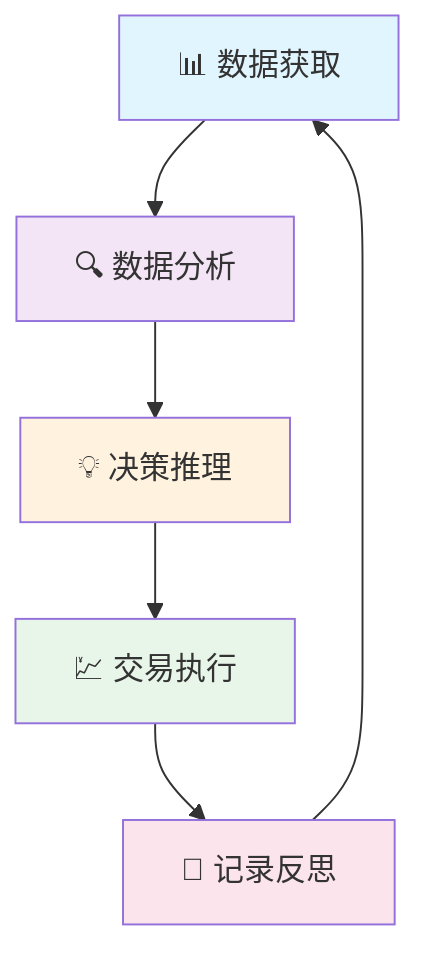

### 核心特性

- 🔄 **闭环优化**: 每次决策都基于历史经验持续改进
- 🧠 **透明可追溯**: 100%决策过程可视化，支持回溯分析
- 📊 **数据驱动**: 基于实时市场数据和历史数据综合分析
- ⚡ **高效执行**: 自动化工具链执行交易决策
- 🎯 **风险可控**: 内置风险管理机制和止损策略

---

## 📊 阶段一：数据获取

AI决策的第一步是获取全面的市场信息，包括价格数据、成交量、新闻资讯等。

### 数据源架构

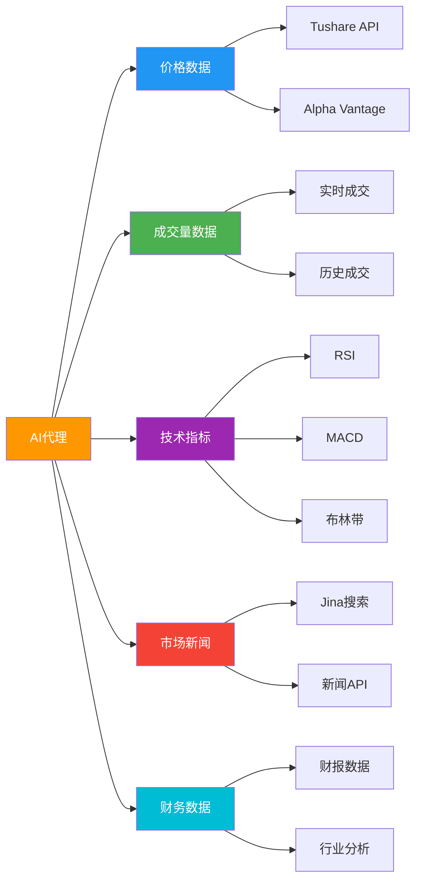

### 数据获取流程

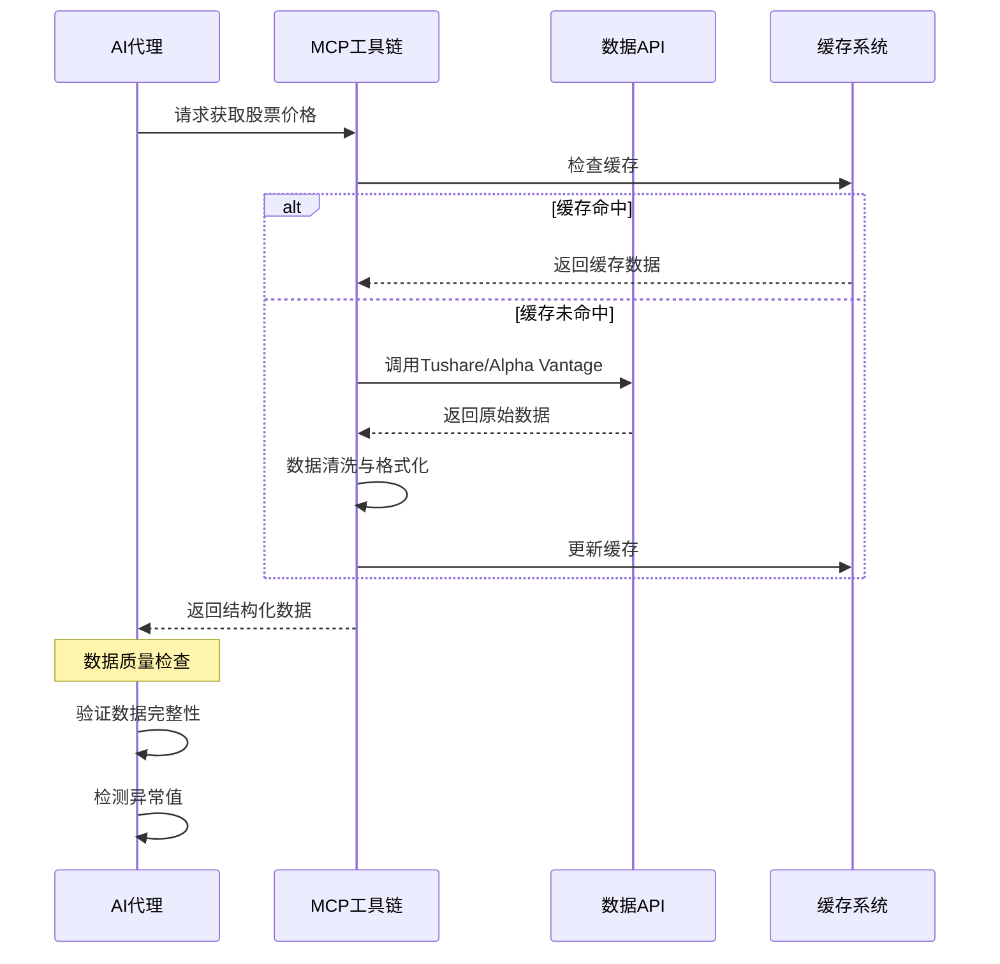

### 数据质量控制

| 检查项 | 检查内容 | 处理方式 |
|--------|----------|----------|
| **完整性** | 缺失值检测 | 自动填充或跳过该交易日 |
| **准确性** | 价格异常检测 | 对比历史数据，剔除离群值 |
| **时效性** | 数据更新延迟 | 标记数据时效性，优先使用最新数据 |
| **一致性** | 多源数据比对 | 交叉验证，差异超阈值则告警 |

---

## 🔍 阶段二：数据分析

AI接收到数据后，会进行多维度、深层次的分析，包括技术分析、基本面分析和情绪分析。

### 分析框架

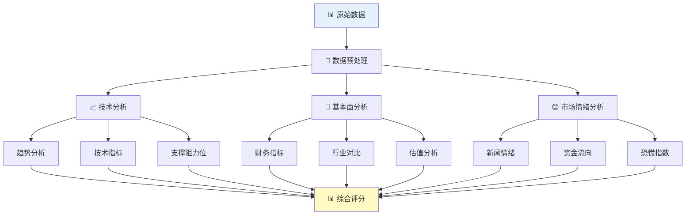

### 技术分析详解

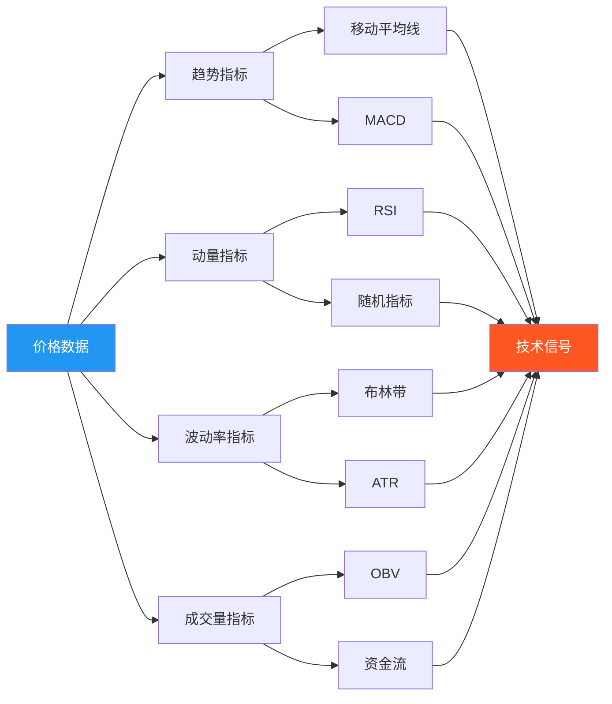

### 分析输出示例

```json
{
  "analysis_id": "2025-10-31-001",
  "timestamp": "2025-10-31 14:30:00",
  "symbol": "600036.SH",
  "analysis_type": "comprehensive",
  "technical_indicators": {
    "rsi": 65.4,
    "macd": {
      "value": 0.85,
      "signal": "golden_cross",
      "histogram": 0.12
    },
    "bollinger_bands": {
      "upper": 32.50,
      "middle": 30.20,
      "lower": 27.90,
      "position": "upper_band"
    },
    "moving_averages": {
      "ma5": 29.80,
      "ma20": 28.50,
      "ma60": 27.20,
      "trend": "bullish"
    }
  },
  "fundamental_metrics": {
    "pe_ratio": 12.5,
    "pb_ratio": 1.8,
    "roe": 15.2,
    "debt_ratio": 0.45
  },
  "sentiment_analysis": {
    "news_sentiment": 0.65,
    "fear_greed_index": 72,
    "sector_rotation": "positive"
  },
  "risk_assessment": {
    "volatility": 0.28,
    "beta": 1.15,
    "max_drawdown": 0.12,
    "risk_score": 6.5
  },
  "composite_score": 7.8
}
```

---

## 💡 阶段三：决策推理

这是AI决策的核心阶段，AI会将分析结果转化为具体的交易决策，包括买/卖/持有，以及仓位管理。

### 决策流程

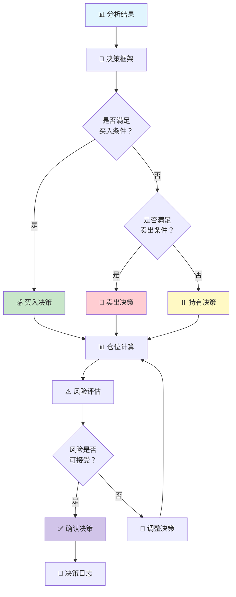

### 决策推理链示例

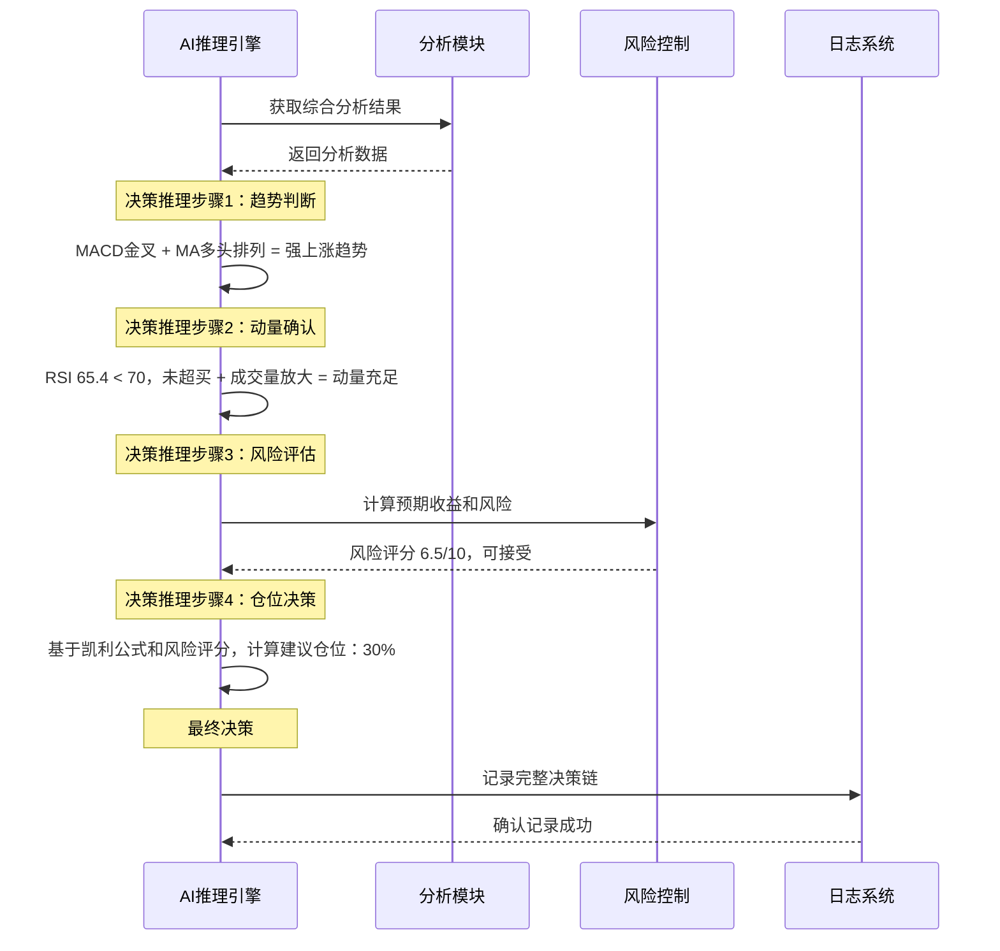

### 决策逻辑树

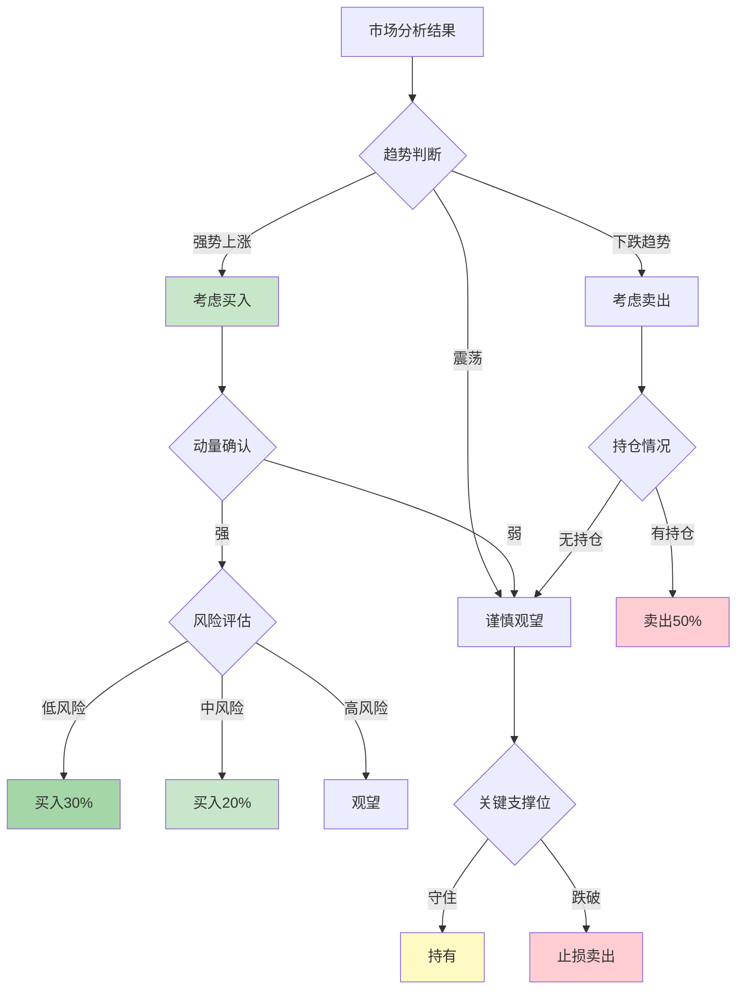

### 决策输出

```json
{
  "decision_id": "2025-10-31-001",
  "timestamp": "2025-10-31 14:30:00",
  "symbol": "600036.SH",
  "decision": "buy",
  "reasoning_chain": [
    {
      "step": 1,
      "type": "trend_analysis",
      "description": "MACD金叉且价格突破布林带上轨，技术面显示强势上涨信号",
      "confidence": 0.85
    },
    {
      "step": 2,
      "type": "momentum_check",
      "description": "RSI为65.4，尚未超买，成交量放大确认上涨动能",
      "confidence": 0.78
    },
    {
      "step": 3,
      "type": "risk_assessment",
      "description": "波动率28%，Beta 1.15，风险评分6.5/10，风险可控",
      "confidence": 0.82
    },
    {
      "step": 4,
      "type": "position_sizing",
      "description": "基于凯利公式和风险评分，建议仓位30%",
      "confidence": 0.75
    }
  ],
  "final_decision": {
    "action": "buy",
    "percentage": 30,
    "shares": 1000,
    "estimated_price": 30.20,
    "stop_loss": 27.90,
    "take_profit": 33.50,
    "confidence": 0.80
  },
  "expected_return": 10.9,
  "max_risk": 7.6
}
```

---

## 💹 阶段四：交易执行

AI通过MCP工具链执行交易决策，确保交易符合A股市场规则（T+1、100股整数倍等）。

### 执行流程

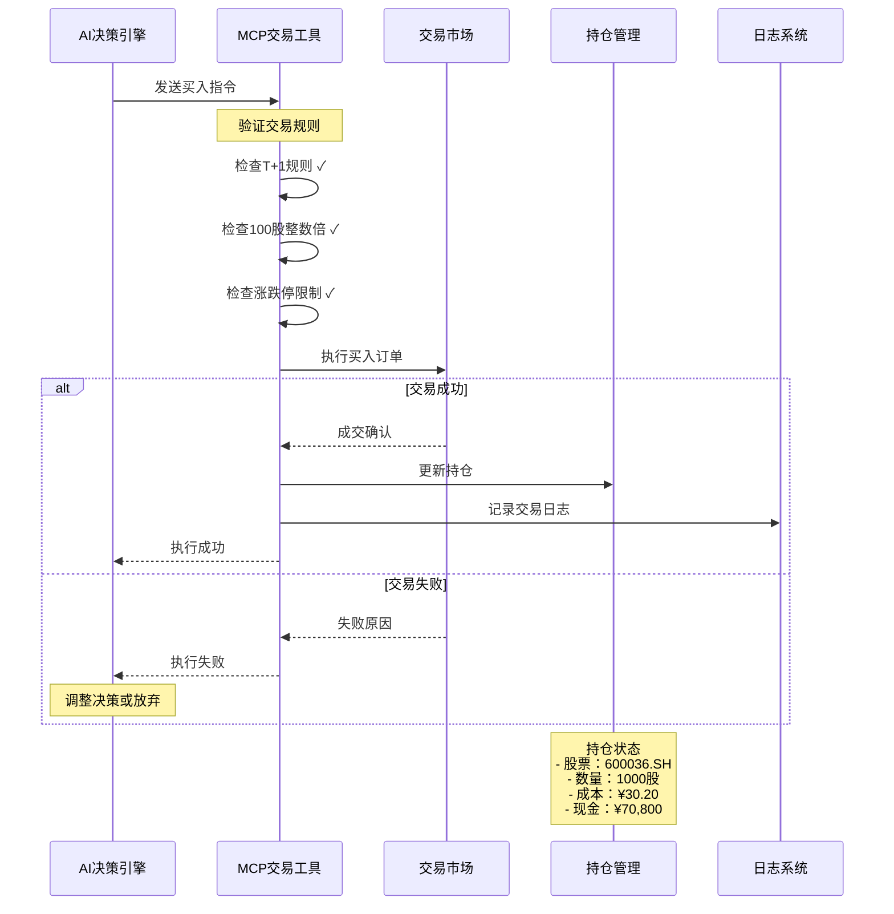

### 执行规则检查

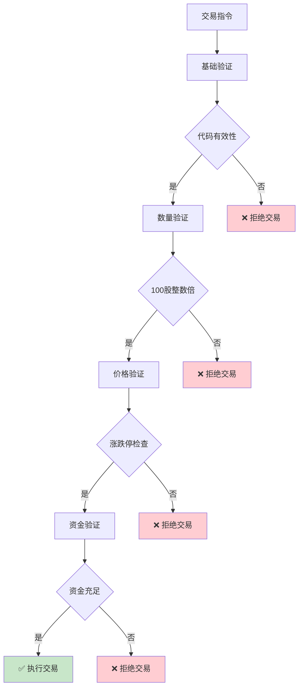

### 交易执行日志

```json
{
  "trade_id": "T20251031001",
  "timestamp": "2025-10-31 14:30:15",
  "symbol": "600036.SH",
  "action": "buy",
  "order_type": "market",
  "requested": {
    "shares": 1000,
    "estimated_price": 30.20
  },
  "executed": {
    "shares": 1000,
    "price": 30.18,
    "amount": 30180.00,
    "commission": 5.02,
    "total_cost": 30185.02
  },
  "rules_check": {
    "lot_size": "passed",
    "t_plus_1": "passed",
    "price_limit": "passed",
    "fund_sufficient": "passed"
  },
  "portfolio_before": {
    "cash": 100000.00,
    "positions": {},
    "total_value": 100000.00
  },
  "portfolio_after": {
    "cash": 69814.98,
    "positions": {
      "600036.SH": {
        "shares": 1000,
        "avg_cost": 30.18,
        "market_value": 30180.00
      }
    },
    "total_value": 99994.98
  },
  "status": "success"
}
```

---

## 📝 阶段五：记录与反思

AI会将整个决策和执行过程记录下来，用于后续学习和策略优化。

### 记录体系

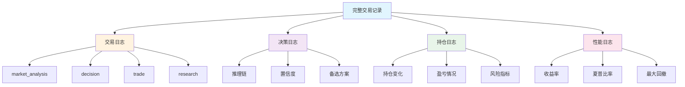

### 反思优化流程

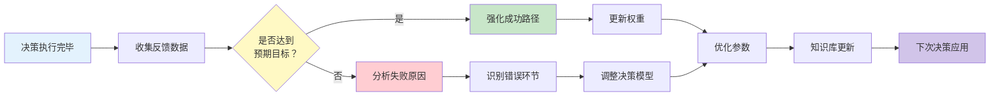

### 学习更新机制

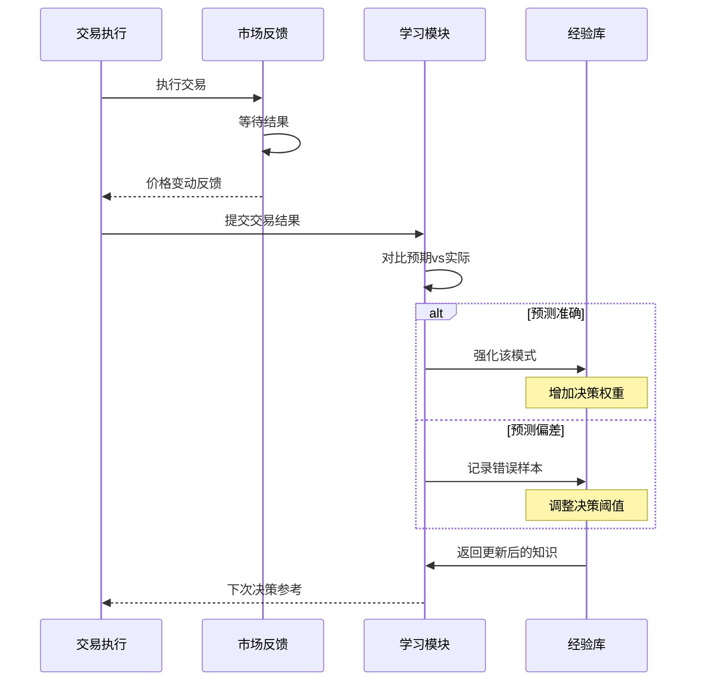

---

## 🌈 完整决策链可视化

将所有阶段整合，呈现AI从输入到输出的完整决策链：

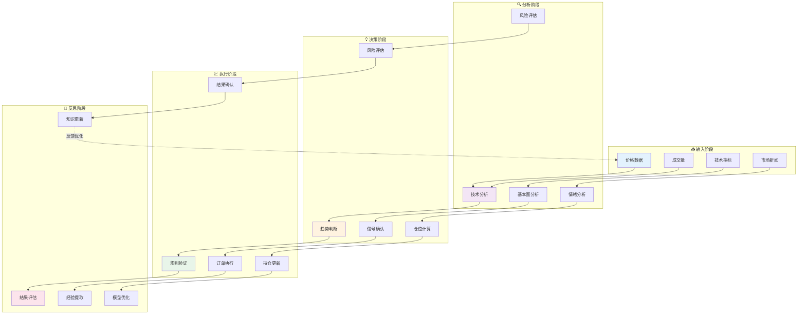

### 时间线视图

```mermaid
gantt
    title AI决策流程时间线
    dateFormat  X
    axisFormat %S秒

    section 数据获取
    请求数据           :0, 2
    数据清洗           :2, 3
    质量检查           :3, 4

    section 数据分析
    技术分析           :4, 8
    基本面分析         :8, 11
    情绪分析           :11, 13
    风险评估           :13, 15

    section 决策推理
    趋势判断           :15, 17
    信号确认           :17, 19
    仓位计算           :19, 21
    风险评估           :21, 23

    section 交易执行
    规则验证           :23, 24
    订单提交           :24, 25
    成交确认           :25, 28
    持仓更新           :28, 30

    section 记录反思
    结果记录           :30, 32
    经验提取           :32, 34
    模型优化           :34, 36
```

---

## 📖 AI决策日志示例

以下是AI在一次完整交易中的日志记录示例：

### 日志文件结构

```
data/agent_data_astock/deepseek-chat-v3.1/log/2025-10-31/log.jsonl
```

### 日志内容

```jsonl
{"type": "market_analysis", "timestamp": "2025-10-31 09:30:00", "summary": "开盘分析：市场高开0.5%，银行板块领涨", "analysis": {"indicators": {"rsi": 52.3, "macd": "golden_cross", "ma20_slope": "positive"}, "sentiment": "市场情绪偏乐观，资金流入明显"}, "confidence": 0.78}

{"type": "research", "timestamp": "2025-10-31 10:15:00", "summary": "研究招商银行最新财报", "findings": ["Q3净利润同比增长8.2%", "不良贷款率降至1.2%", "拨备覆盖率提升至180%", "零售业务增长强劲"]}

{"type": "decision", "timestamp": "2025-10-31 14:30:00", "summary": "决定买入招商银行", "decision": {"action": "buy", "symbol": "600036.SH", "reasoning": "技术面MACD金叉 + 基本面改善，建议买入30%仓位", "confidence": 0.80}, "risk_assessment": {"max_risk": 7.6, "expected_return": 10.9}}

{"type": "trade", "timestamp": "2025-10-31 14:30:15", "summary": "成功买入招商银行1000股", "trade": {"action": "buy", "symbol": "600036.SH", "amount": 1000, "price": 30.18, "total_cost": 30185.02, "reasoning": "按计划执行买入指令，价格符合预期"}}

{"type": "market_analysis", "timestamp": "2025-10-31 15:00:00", "summary": "收盘分析：招商银行收涨2.3%，交易执行成功", "analysis": {"indicators": {"rsi": 58.7, "macd": "strong_bullish", "ma20_slope": "positive"}, "sentiment": "市场表现良好，持仓浮盈"}, "confidence": 0.82}
```

### 前端可视化展示

在AI思考全过程页面中，这些日志会被渲染为：

```html
<div class="reasoning-summary">
    <h3>📊 分析记录概览</h3>
    <div class="summary-stats">
        <div class="stat-item">
            <span class="stat-label">市场分析</span>
            <span class="stat-value">2</span>
        </div>
        <div class="stat-item">
            <span class="stat-label">研究记录</span>
            <span class="stat-value">1</span>
        </div>
        <div class="stat-item">
            <span class="stat-label">决策记录</span>
            <span class="stat-value">1</span>
        </div>
        <div class="stat-item">
            <span class="stat-label">交易行动</span>
            <span class="stat-value">1</span>
        </div>
    </div>
</div>

<div class="reasoning-sections">
    <div class="reasoning-section market-analysis">
        <div class="section-header">
            <h3>🔍 市场分析 <span class="count">(2)</span></h3>
            <span class="toggle-icon">▲</span>
        </div>
        <div class="section-content">
            <div class="log-item">
                <div class="log-header">
                    <span class="log-type">市场分析</span>
                    <span class="log-timestamp">2025-10-31 09:30:00</span>
                </div>
                <div class="log-content">
                    <div class="analysis-summary">
                        <div class="summary-text">开盘分析：市场高开0.5%，银行板块领涨</div>
                        <div class="indicators">
                            <h4>技术指标</h4>
                            <ul>
                                <li><strong>RSI:</strong> 52.3</li>
                                <li><strong>MACD:</strong> golden_cross</li>
                                <li><strong>MA20斜率:</strong> positive</li>
                            </ul>
                        </div>
                        <div class="sentiment">
                            <h4>市场情绪</h4>
                            <p>市场情绪偏乐观，资金流入明显</p>
                        </div>
                    </div>
                </div>
            </div>
        </div>
    </div>
</div>
```

---

## 🎯 核心优势

### 1. 透明度
- **100%可追溯**: 每个决策都有完整的推理链
- **实时展示**: 前端页面实时展示AI思考过程
- **日志完整**: JSONL格式详细记录每个环节

### 2. 自适应性
- **持续学习**: 从每次交易中学习和改进
- **动态调整**: 根据市场变化调整策略
- **经验积累**: 知识库不断更新优化

### 3. 风险控制
- **多层验证**: 技术面+基本面+情绪面三重确认
- **自动止损**: 内置风险控制机制
- **仓位管理**: 基于凯利公式的科学仓位计算

### 4. 高效执行
- **自动化**: 全流程自动化，无需人工干预
- **规则适配**: 自动适配A股交易规则
- **快速响应**: 秒级决策和执行

---

## 📊 决策性能指标

### 评估维度

| 维度 | 指标 | 目标值 |
|------|------|--------|
| **准确性** | 决策准确率 | >65% |
| **收益率** | 年化收益率 | >15% |
| **风险控制** | 最大回撤 | <20% |
| **夏普比率** | 风险调整后收益 | >1.0 |
| **胜率** | 盈利交易占比 | >55% |

### 持续优化

AI通过以下方式持续提升决策质量：

1. **历史回测**: 在历史数据上验证策略有效性
2. **A/B测试**: 对比不同决策模型的表现
3. **参数调优**: 优化技术指标参数和阈值
4. **知识蒸馏**: 将经验转化为可复用的决策模板

---

## 🔮 未来演进

### 短期目标（1-3个月）
- [ ] 集成更多技术指标（KDJ、CCI、WR等）
- [ ] 增加多时间框架分析（日线+周线）
- [ ] 优化仓位管理算法

### 中期目标（3-6个月）
- [ ] 引入机器学习预测模型
- [ ] 实现强化学习自适应策略
- [ ] 开发自然语言交易报告

### 长期愿景（6-12个月）
- [ ] 构建行业知识图谱
- [ ] 实现多资产组合优化
- [ ] 开发实时风控系统

---

**结语**

AI-Trader的决策流程是一个**数据驱动、智能决策、透明执行**的完整闭环。通过可视化展示AI的思维过程，我们不仅能更好地理解和信任AI的决策，更能持续优化和改进系统，推动AI在金融领域的发展。

---

*© 2025 AI-Trader | 让AI决策完全透明化*
